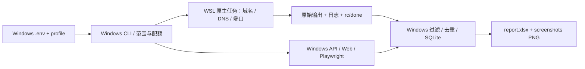

# 工具、数据与流水线操作说明

核查日期：2026-10-10，Session 005。本说明依据本机安装清单、当前代码、CLI/help、只读报告检查和两端网络实测；版本不代表上游最新版。安装、接入调度、本地验收和公网验收分别记录。

## 1. 现在能交付什么

这是可复用的互联网暴露面收集与资产归属治理框架。每个项目有独立配置、SQLite 数据库、原始工具结果、阶段证据和八表 xlsx；主动 Web 阶段还生成首页 PNG。结果表会填入采集到的数据，既可作为资产清单，也可作为人工核对入口。

当前自动报告是 `report.xlsx`，截图是外部 `screenshots/*.png`，不是嵌入 Excel 的图片。尚未实现自动 HTML 结果报告。根目录 `asm_full_design_v2.html`、`deploy_topology_v2.html` 是设计文档，不是扫描产物。完整 v2.0 方法尚未全部接入，见 [COVERAGE.md](COVERAGE.md)。

本机已有样例：`D:\Desktop\asm\data\test\report.xlsx`；它是回环测试结果，不是某家企业的公网资产。总表 4 行、urls 14 行、todos 14 行，首页截图 `data/test/screenshots/1.png` 为 1280×720 的 Fixture Portal。只有 Web 服务取得首页截图，普通 TCP/UDP 服务没有截图。

## 2. Windows 安装与职责

| 工具/组件 | 当前版本或位置 | 调用与职责 | 保存内容 |
|---|---|---|---|
| PowerShell 7 Core | 7.6.5；`pwsh.exe` | 所有 Windows shell 命令入口 | 可按任务保存终端日志；流水线另有 JSONL |
| Windows Python | 3.11.9；项目 `.venv` | `./.venv/Scripts/python.exe -m asm`，编排、API、入库、报告 | 每项目 `asm.db`、阶段 JSON、日志 |
| ASM Workbench | 0.1.0，仓库 editable 安装 | `doctor/run/stage/report/quota/init-wsl` | `data/<profile>/` |
| Python httpx | 0.28.1 | Stage 7 有界 HTTP 请求；搜索引擎适配器使用 Python 客户端 | 状态/标题/长度/技术线索入库；未自动归档整页 HTML |
| dnspython | 2.9.0 | Windows 显式上游 DNS 复核 | DNS 来源/上游/差异证据 |
| Playwright + Chromium | Playwright 1.63.0；浏览器已安装 | 当前 Stage 7 首页截图、每个浏览器请求的范围控制 | PNG |
| openpyxl | 3.1.5 | Stage 8 八表 Excel 导出 | xlsx |
| tldextract | 5.4.0 | 注册域识别与域名范围判断 | 标准化域名字段 |
| SQLite | Python 标准库 | 数据库为结果依据，xlsx 是导出快照 | `asm.db` |
| pytest / ruff | 9.1.1 / 0.16.10 | 开发验证、静态检查 | JUnit XML/检查日志 |
| Git / GCM | Git 2.51.0.windows.1；GCM 已用于推送 | 版本管理和 GitHub 认证 | 提交记录；凭据由 GCM 管理 |

Windows 的 Python `httpx` 库与 WSL 的 ProjectDiscovery `httpx` 二进制是两个不同组件。当前 Web 主流程用前者，外部扫描二进制位于 WSL。

## 3. WSL 安装、输出与用途

发行版实际名称为 `Ubuntu`，Ubuntu 24.04.4，WSL2；默认用户 `longchuanli`。原生工作区 `/home/longchuanli/asm-ws`，Python 工具各用独立 venv。固定版本见 `tools/tool-lock.json`，实装清单在 WSL `manifests/installed.txt`。

| 工具 | 当前版本 | 接入状态 | 输出如何保存 | 输出如何利用 |
|---|---|---|---|---|
| subfinder | 2.17.0 | Stage 4 自动调用 | `subdomains.txt`、job.log | 域名标准化/范围过滤，合并来源，交 Stage 5 |
| OneForAll | v0.4.5，固定 commit `5ad26a99cd8625dfff0f3ce0300a10b38135b03a` | Stage 4 隔离被动调用；默认五来源、支持七来源 | `oneforall-observations.json`、`oneforall.json`、模块 JSON、SQLite、日志 | 保留去重前全部来源；只导入域名，不信任上游 IP/80 端口 |
| dnsx | 1.3.1 | Stage 5 自动调用 | `dnsx.jsonl` | 按解析商保留 DNS 记录，与 dig/Windows 比对 |
| dig | 已安装 dnsutils | Stage 5 包装器自动调用 | 包装器 `dig.jsonl`；人工调用可存文本 | 五类记录、CNAME 链与异常证据，选择可用地址 |
| nmap | 7.94SVN | Stage 6 默认引擎；回环 TCP/UDP 已验收 | `nmap.xml`、job.log | IP/端口/传输协议/服务/版本入库，Web 服务交 Stage 7 |
| masscan | 1.3.2 | Stage 6 可选；完整实际扫描验收待补 | `masscan.json` | 端口候选再用 nmap 确认服务 |
| naabu | 2.6.1 | 已安装，未接入阶段自动调度 | 手动 `-j -o naabu.jsonl` | 端口候选；需服务复核和后续适配器 |
| ProjectDiscovery httpx | 1.12.0 | 已安装，未接入 Stage 7 | 手动 `-j -o httpx.jsonl` | HTTP 存活、标题、技术线索；当前不自动入库 |
| ffuf | 2.3.0 | 已安装，未接入 Stage 7 | 手动 `-of json -o ffuf.json` | 路径候选需排除统一返回页，再复核状态和内容 |
| katana | 1.8.0 | 已安装，未接入 Stage 7 | 手动 `-j -o katana.jsonl` | URL/JS/表单线索；再做范围、URL、参数核对 |
| gowitness | 3.2.0 | 已安装，尚待每个浏览器请求的范围控制 | 显式 `--write-jsonl` 与 PNG 目录 | 页面证据与元数据关联；当前截图由 Windows Playwright 承担 |
| Google Chrome | 155.0.8059.39 | WSL 已安装；当前截图主流程不调用它 | 被调用时产生截图 | gowitness 的浏览器运行时 |
| wafw00f | 2.4.2 | 已安装，未自动调度 | 手动 `-o wafw00f.json` | WAF 指纹辅助解释状态码；不是确认归属或漏洞的依据 |
| nuclei | 3.11.1 | 二进制已安装；未自动执行模板，模板库未单独验收 | 手动 `-jsonl -o nuclei.jsonl` | 模板命中是待复核线索，不自动标成已确认漏洞 |
| a_scan.py | 项目 stdlib TCP 工具 | 已部署并通过 help 自检；未自动调度 | stdout JSONL | TCP connect 端口候选，无服务版本识别 |
| SecLists | 2026.1，稀疏检出 7 文件 | 只安装所需 DNS/Web 字典及 README/LICENSE | 输入字典，非采集结果 | 提供爆破候选；Stage 4 当前用内置 DNS_PREFIXES，不自动读全部 SecLists |

WSL 还安装了 Git 和原生 Python 3.12。Amass、gau、waybackurls、LinkFinder、arjun、x8 当前未安装。不能把工具存在等同于所有功能已串入主流程。

### 3.1 从 PowerShell 7 调用

优先使用 ASM 阶段入口，它会处理输入、原生目录、超时、日志、回收、解析和数据库：

```powershell
Set-Location 'D:\Desktop\asm'
.\.venv\Scripts\python.exe -m asm --help
.\.venv\Scripts\python.exe -m asm doctor
# 下面 customer 必须是已配置的项目，不是内置 profile
.\.venv\Scripts\python.exe -m asm stage 4 --profile customer --passive-only
```

只看某个原生工具帮助：

```powershell
wsl.exe -d Ubuntu --cd /home/longchuanli/asm-ws -- bash -lc 'export PATH="$HOME/asm-ws/bin:$PATH"; subfinder -h'
wsl.exe -d Ubuntu --cd /home/longchuanli/asm-ws -- bash -lc '$HOME/asm-ws/tools/wafw00f/.venv/bin/wafw00f --help'
wsl.exe -d Ubuntu --cd /home/longchuanli/asm-ws -- bash -lc '$HOME/asm-ws/tools/OneForAll/.venv/bin/python $HOME/asm-ws/tools/OneForAll/oneforall.py --help'
```

OneForAll 主 `run/main` 即使关闭 brute/dns/req，仍可能查询 wildcard/SRV 和扩到父注册域。实际采集使用 Stage 4 的 `tools/oneforall_runner.py`，不直接启动上游默认全流程。

### 3.2 人工工具输出规范

下面是**进入 WSL 后**的 Bash 示例，Windows 入口仍是 PowerShell 7。`authorized.invalid`、`192.0.2.10` 是文档占位符，运行前替换为项目范围内目标。当前公共 53 端口 DNS 存在 fake-IP，实网采集先解决第 8 节解析问题。

```bash
export PATH="$HOME/asm-ws/bin:$HOME/asm-ws/tools/wafw00f/.venv/bin:$PATH"
OUT="$HOME/asm-ws/results/manual/$(date -u +%Y%m%dT%H%M%SZ)"
mkdir -p "$OUT"
ROOT='authorized.invalid'
URL='https://authorized.invalid'
IP='192.0.2.10'
printf '%s\n' "$ROOT" > "$OUT/domains.txt"
printf '%s\n' "$URL" > "$OUT/urls.txt"
run_logged() {
  local name="$1"; shift
  "$@" > "$OUT/$name.stdout.log" 2> "$OUT/$name.stderr.log"
  local code=$?
  printf '%s\n' "$code" > "$OUT/$name.rc"
  return "$code"
}
```

常用格式和调用示例如下。每次选择所需工具执行，不是要求把全部工具一起运行：

```bash
run_logged subfinder subfinder -d "$ROOT" -silent -duc -o "$OUT/subdomains.txt"
run_logged dnsx dnsx -l "$OUT/domains.txt" -a -aaaa -mx -ns -cname -j -silent -nc -duc -retry 1 -t 8 -rl 60 -timeout 3s -r 1.1.1.1 -o "$OUT/dnsx.jsonl"
run_logged dig dig @1.1.1.1 "$ROOT" A
run_logged nmap sudo nmap -sS -sV -sC -Pn -n -p 80,443 -oX "$OUT/nmap.xml" "$IP"
run_logged masscan sudo masscan "$IP" -p80,443 --rate 1000 -oJ "$OUT/masscan.json"
run_logged naabu naabu -host "$IP" -p 80,443 -s c -verify -rate 100 -duc -j -o "$OUT/naabu.jsonl"
run_logged httpx httpx -l "$OUT/urls.txt" -sc -title -td -j -r 1.1.1.1 -allow "$IP" -duc -o "$OUT/httpx.jsonl"
run_logged ffuf ffuf -u "$URL/FUZZ" -w "$HOME/asm-ws/wordlists/SecLists/Discovery/Web-Content/raft-medium-directories.txt" -rate 50 -of json -o "$OUT/ffuf.json"
run_logged katana katana -u "$URL" -cs '^https://authorized\.invalid(?::443)?(?:/|$)' -dr -duc -rl 10 -j -o "$OUT/katana.jsonl"
run_logged wafw00f wafw00f -r -o "$OUT/wafw00f.json" "$URL"
run_logged a_scan python3 "$HOME/asm-ws/tools/a_scan.py" --host "$IP" --ports 80,443 --timeout 1 --threads 8
```

katana 的 crawl-scope 需同步改成精确批准主机，不能保留上面的占位正则；其默认 rdn 范围和自动跳转不能直接视为合适的项目边界。以上 httpx 没有开启跟随重定向，ffuf 默认不跟随重定向。masscan/naabu/a_scan 的开放端口仍需 nmap 服务复核。

gowitness 参数可在运行中的 **WSL 本地 fixture** 核对：

```bash
printf '%s\n' 'http://127.0.0.1:8765' > "$OUT/local-urls.txt"
run_logged gowitness gowitness scan file -f "$OUT/local-urls.txt" --chrome-path /usr/bin/google-chrome --write-jsonl --write-jsonl-file "$OUT/gowitness.jsonl" --screenshot-format png --screenshot-path "$OUT/screenshots"
```

生产接入前须完成浏览器导航、子资源和每个请求的范围控制。仅控制输入 URL 还不等于控制页面中的外部请求。gowitness 默认图片格式为 JPEG，默认不一定保存元数据，上例已显式设置。

nuclei 仅在准备好选定模板后调用，例如 `TEMPLATE='/path/to/approved-template.yaml'`，然后 `run_logged nuclei nuclei -u "$URL" -t "$TEMPLATE" -duc -dr -ni -rl 10 -jsonl -o "$OUT/nuclei.jsonl"`。该模板路径需要自行准备；本机安装状态不代表模板集完整或规则已验收。

人工结果放进 `results/` 并不会自动导入 ASM。当前没有通用 `asm ingest/search` 命令；尚未接入的工具需增加对应适配器及范围过滤。保留结构化原始输出、stdout/stderr、返回码、版本、输入和采集时间，避免只保存终端截图。JSONL 是每行一个 JSON 对象，不能按整个 JSON 数组解析。

## 4. .env 填哪些 API

本机所有搜索引擎凭据目前为空，没有进行带账户的真实 API 搜索验收。

```dotenv
PYTHONUTF8=1
WSL_DISTRO=Ubuntu
WSL_USER=
FOFA_EMAIL=
FOFA_KEY=
QUAKE_TOKEN=
HUNTER_KEY=
ZOOEYE_KEY=
SHODAN_KEY=
CENSYS_ID=
CENSYS_SECRET=
```

| 引擎 | 本项目变量 | 当前作用 |
|---|---|---|
| FOFA | `FOFA_EMAIL` + `FOFA_KEY`，两者一起填写 | Stage 4 与证书线索支路会使用；空凭据跳过 |
| Quake | `QUAKE_TOKEN` | Stage 4 会使用；空凭据跳过 |
| Hunter | `HUNTER_KEY` | 已有响应适配器，未接主流程引擎路由 |
| ZoomEye | `ZOOEYE_KEY` | 已有响应适配器，未接主流程引擎路由 |
| Shodan | `SHODAN_KEY` | 已有响应适配器，未接主流程引擎路由 |
| Censys | `CENSYS_ID` + `CENSYS_SECRET` | 当前适配器仍是 Legacy Search v2；未迁移/未接主流程 |

想使用现有自动搜索优先配置 FOFA、Quake。离线演示、本地链路、基本公开被动来源、DNS、截图及 xlsx 导出不要求购买全部 API。`engine_priority` 尚不是生效的完整路由器，填入后四家 key 不会自动启用它们。

Censys 官方 Platform 已采用 `https://api.platform.censys.io/v3/`、PAT 和 API Access role；当前 ID/secret 的旧适配器不能当作已支持新接口，也不能直接把 PAT 填进 CENSYS_SECRET 后假定可用。见 [官方迁移指南](https://docs.censys.com/docs/platform-api-transition-guide)。

subfinder 的额外提供商凭据在 WSL `~/.config/subfinder/provider-config.yaml`，不会自动同步 Windows `.env`。当前 OneForAll 白名单使用公开来源，不传付费模块 key；本项目没有 Google/Bing 搜索 API 环境变量。`.env` 被忽略，密钥不写进 profiles、命令行、Git 或报告；进程已有环境变量优先于 `.env`。

FOFA 最小间隔 15 秒、每项目数据库每日最多 200 次请求，包含账户信息调用；这是请求次数，不是资产条数。跨 profile 共享配额仍待实现。查看账本：`./.venv/Scripts/python.exe -m asm quota --profile customer`。

## 5. 流水线如何搭建与运行

现有机器已经安装完成，无需重复 init-wsl。新机器流程是 Windows venv/editable 安装 → Playwright Chromium → `asm init-wsl --distro <实际名称>` → `.env` → profile → doctor → 离线/本地验证 → 实网项目。详见 [RUNBOOK.md](RUNBOOK.md)。

Windows 配置、范围和限速由 CLI 读取，向 WSL 原生任务目录通过 stdin 写入输入/包装器，启动限时工具，等待完成 marker，再通过 tar 字节管道取回原始结果。Windows 解析和立即入库，最后导出报告。外部工具不直接读写 `/mnt/d` 或 UNC 路径。



| 阶段 | 输入 → 行为 → 后续用途 |
|---|---|
| 1 | 公司/品牌/root/IP 种子 → 标准化 → 主体与目标基线 |
| 2a | 股权人工导入或 fixture → ≥51% 递归 → 子公司清单；真实第三方站点 selectors 未完成 |
| 2b | ICP 人工导入、主动授权 footer → 备案线索；工信部完整自动反查未完成 |
| 3 | 域名/IP 范围 + SaaS 排除 → 主动范围检查；域名授权不自动等于 IP 授权 |
| 4 | root → subfinder/OneForAll/公开来源/FOFA/Quake → 带来源子域；主动授权时才字典查询 |
| 5 | 子域 → 多上游 DNS、CNAME、CDN、差异核对 → selected 可用 IP |
| 6 | selected 中位于批准 IP 范围的地址/显式端口目标 → nmap 或 masscan+nmap → 服务资产 |
| 7 | `web.urls` 或服务派生 URL → 有界 HTTP、基线/路径、标题/技术线索、PNG → Web 结果与 review |
| p1 | 精确 OSINT 关键词/导入材料 → 人员/系统/待办线索 |
| p2 | 证书/供应商/公告证据 → 系统与供应链待办 |
| 8 | 可信数据库结果 → 八 sheet xlsx + 相对截图链接 |

**当前阶段编排顺序执行**；p1/p2 的名称不表示现在已并发。默认列表把 8 放在 p1/p2 前面；为包含支路新增结果，明确指定 `...,p1,p2,8`。WSL 后台任务与阶段内并发不等于全流水线阶段并发。

在 PowerShell 7 中运行：

```powershell
Set-Location 'D:\Desktop\asm'
# 环境检查，不访问带账户搜索 API
.\.venv\Scripts\python.exe -m asm doctor
# 离线 fixture：单独 dry-run 数据库，无公网资产采集
.\.venv\Scripts\python.exe -m asm run --profile demo --stages 1,2a,2b,3,4,5,p1,p2,8 --dry-run --passive-only
# 真实 Windows/WSL 回环：端口、Web、截图、Excel
.\.venv\Scripts\python.exe scripts/local-demo.py
# 已准备 customer profile 后的基础被动域名/DNS链路
.\.venv\Scripts\python.exe -m asm run --profile customer --stages 1,3,4,5,8 --passive-only
# 已配置主动范围、人工材料和可信解析路径后，完整项目顺序
.\.venv\Scripts\python.exe -m asm run --profile customer --stages 1,2a,2b,3,4,5,6,7,p1,p2,8 --resume
# 仅从已存在数据库刷新报告，不重新扫描
.\.venv\Scripts\python.exe -m asm report --profile customer
```

`customer` 不是内置配置，需要创建 `profiles/customer.yaml`。`targets.company/brands/roots/ip_cidrs` 定义项目输入，`authorization: true` 才允许主动模式，`ports.targets` 可列出批准的具体 IP，`ports.engine` 当前选择 nmap 或 masscan，`web.urls` 可列出批准的具体 HTTP(S) 地址；这些目标不放 `.env`。不能仅写一个大 CIDR 就假定当前代码自动扫完整地址段。

未提供股权/ICP 资料的 2a/2b 可能标 partial；可以先跑基础链路。`--passive-only` 不运行 6/7、不请求目标 footer、不做目标 DNS 字典，但 Stage 5 仍向递归 DNS 查询，Stage 4 仍访问公开提供商；它不会生成首页截图。`--target-local` 限回环，WSL NAT 的 localhost 与 Windows localhost 不同，local-demo 会分别部署夹具。

`--resume` 只跳过同生效配置指纹和模式下完成的阶段，失败/partial 可以重试。工具级相同版本/参数/输入成功任务且本地结果仍在时可复用；即使不加 --resume，也不保证重新向提供商采集。需要全新采集用新的 profile/output 项目库。CLI 对 failed/partial 返回非零，已有有效结果仍保留；非零不能简单解释为“所有数据都无效”。

## 6. 每层输出放在哪里

```text
D:\Desktop\asm\data\<profile>\
  asm.db                         标准化结果、来源、任务、配额、阶段状态、facts
  report.xlsx                    最终八表快照
  screenshots\asset-<id>.png     原始首页 PNG
  screenshots\<序号>.png         按总表序号复制的交付 PNG
  stages\<stage>\*.json          该阶段证据与汇总
  results\<stage>\<jobid>\       从 WSL 回收的原始结果、输入、runner、job.log、rc/done
  logs\pipeline.jsonl            阶段状态/数量/提示
  logs\bridge.jsonl              桥接调用信息
  dry-run\                       仅 --dry-run 的独立数据库/结果
```

WSL 对应运行目录是 `/home/longchuanli/asm-ws/results/<jobid>/`。正常工具结果保存优先使用原生 XML/JSON/JSONL，而不是解析彩色控制台文字。Linux timeout 结束任务为 rc=124；OneForAll 模块/HTTP 部分失败 rc=2，不标完整成功。

重要阶段证据：Stage 4 `subdomains.json`、`oneforall-evidence.json`；Stage 5 `dns-observations.json`（过滤前）、`dns-evidence.json`（来源/上游/链/selected）、`dns.json`（可用记录）；Stage 8 `report-counts.json`。Web 状态/标题/技术线索存库，页面响应有长度上限，尚未自动保存全量目标网页 HTML。FOFA/Quake 当前主要保存标准化字段、来源与配额，未统一归档完整 API 原始响应；不要把其原始凭据或响应日志随报告分享。

交付查看用 `report.xlsx + screenshots/` 一起打包，相对截图链接才有效；内部复查另留 `asm.db + stages/ + results/ + logs/`。等运行结束/关闭数据库后再复制数据库文件，避免只复制一个仍有未合并 WAL 的活动库。

## 7. 如何去重与核对

### 7.1 当前去重键

| 数据 | 去重身份 | 注意 |
|---|---|---|
| 主体 | cid | 公司名相似不自动视为同主体 |
| 域名 | 标准化完整域名 | 小写、去末尾点、IDNA；不同子域仍分别保留 |
| 资产/隔离资产 | `(host, port, proto)` | TCP/UDP 分开；域名 host 与 IP host 不强行合并 |
| DNS | `(domain, rtype, value, resolver)` | 保存解析商差异，不抹去冲突 |
| URL | 原始完整 URL 字符串 | 尚无统一查询参数排序/URL 语义规范化 |
| review | `(kind, url, evidence)` | 证据改变可产生新条目 |

相同键的 source/sources 去重后取并集；原有非空标题/IP/版本等通常保留，不保证新观测覆盖旧字段。当前没有完整的冲突仲裁与历史版本审计；看当前 DNS 时以该域 facts 的 selected 和阶段证据为准，不能只看旧 dns_records。OneForAll 在上游去重前保存观测，以免丢失第二来源。

不能按 IP 把所有域名去重，尤其 CDN/共享云；也不能把 crt.sh 直采和 OneForAll 的 Crtsh 当两份独立归属证明。结果数量、来源标签数量、独立证据数量是不同概念。

### 7.2 逐条核对顺序

1. **范围与主体**：域名是否在批准 root 下，IP 是否在批准 CIDR；ICP、证书、页面主体与公司资料能否解释归属。SaaS 和外部 CNAME 终点不会自动扩大范围。
2. **DNS 真实性**：比较 WSL dig/dnsx 与 Windows、解析商、时间、CNAME 链；查看过滤前 fake-IP 与 selected。当前三个显式上游都被影响，三份一致不能视为独立验证。
3. **服务与页面**：端口是否复核、proto/service/version 是什么，HTTP 状态/标题/技术线索与截图是否一致。总表未独列 proto，核对 TCP/UDP 回数据库/原始 XML。
4. **误报基线**：与三个随机不存在路径比较；统一返回页、403、502、仅 CNAME/NXDOMAIN 都不能直接判定泄露/接管。todos 是待核对项，不是已确认漏洞列表。
5. **证据完整性**：看 jobs 返回码、partial、隔离表和来源失败；无结果需要区分“来源成功返回空”与“超时/凭据缺失/解析无效”。

assets 总表只从可信资产表导出；A/B 可进入资产，未验证 C/D 留在隔离表。置信度表示归属证据等级，不表示漏洞真实性、在线状态或截图存在。新增来源标签本身不会自动触发置信度升级。

内部可用 SQLite 只读查询辅助复查：

```sql
SELECT host,port,proto,service,source,confidence FROM assets ORDER BY host,port,proto;
SELECT host,port,proto,reason FROM assets_quarantine;
SELECT stage,tool,status,rc,log_path FROM jobs WHERE status!='completed';
SELECT domain,rtype,value,resolver,ts FROM dns_records ORDER BY domain,rtype,resolver;
SELECT kind,url,severity,status FROM findings WHERE status!='rejected';
```

可通过 Windows Python 标准库 `sqlite3.connect('file:data/<profile>/asm.db?mode=ro', uri=True)` 打开，不依赖另装 sqlite 命令行。人工判定需回写相应业务状态并重新导出；只改 xlsx 不会更新数据库。

## 8. Windows / WSL 网络现状

2026-10-10 11:01 CST 左右，两端对公开主页做无凭据 HEAD 抽检，保留 TLS 验证且不自动跟随跳转：

| 主机 | Windows 状态 | WSL 状态 |
|---|---|---|
| github.com | 200 | 200 |
| pypi.org | 200 | 200 |
| fofa.info | 200 | 200 |
| quake.360.net | 301 | 301 |
| crt.sh | 200 | 200 |
| api.certspotter.com 主页 | 404 | 404 |

这些状态证明抽检时 TCP/TLS/HTTP 能得到响应；301/404 不证明搜索 API 调用成功、账户有效或覆盖率足够。两端没有 HTTP_PROXY/HTTPS_PROXY/ALL_PROXY/NO_PROXY 环境变量，但可能受系统网络路径影响。WSL 仍提示 localhost 代理未镜像至 NAT；不能据此判定 WSL 完全不通网。

**解析问题仍未解决**：Windows/WSL 系统 DNS，以及显式 1.1.1.1、114.114.114.114、8.8.8.8 的 UDP/TCP 53，对 `example.com A` 全返回 `198.18.0.122`。因此本机显式上游并未绕过 fake-IP。代理/TUN 对 DNS 路径的拦截是当前推断，具体配置原因尚未核定。

WSL 的 Google/Cloudflare HTTPS DNS 对照均 200，得到 `104.20.23.154`、`172.66.147.243`。Windows 初次连接失败/Google TLS 握手超时，随后仍启用 TLS 验证的 Cloudflare 请求和使用系统 trust store 的两家请求成功，得到同样两地址；不能仅据超时认定证书配置错误。这只是当时 `example.com` 的对照观测，不是业务目标资产。

Stage 4/5 拒绝 `0.0.0.0`、`::` 和默认 `198.18.0.0/15`，会避免把 fake-IP 当作可用扫描地址，但**过滤不会找回真实 IP**；全部被拒绝时 selected 为空，后续可能无 IP 目标。当前 dns.resolvers 只接受 IP/IP:port，不支持把 DoH URL 直接填入。

下一步先建立可信解析路径，例如核定代理 DNS 排除/真实解析设置，或增加经过验证的 DoH 适配器/可信本地转发器，再用两端对照复测，之后开展实网资产归属和端口核对。本次没有修改系统 DNS、代理、网络或防火墙。

本地证据（均被 Git 忽略）：`data/validation/doctor-current.json`、`network-windows.json`、`network-wsl.json`、`network-doh-windows.json`、`network-doh-windows-detail.json`、`network-doh-wsl.json`。doctor 重新通过 18/18，它证明部署可用，不证明解析可信或所有 API 可用。

## 9. 最终表格字段

| sheet | 内容 |
|---|---|
| 总表 | 序号、资产、端口、标题、技术栈、等级标注、来源、置信度、截图链接 |
| equity | cid、name、parent_cid、share_pct、level、website、email_suffix |
| domains | domain、registrable、tag5、confidence、wildcard、ip、sources |
| ips | ip、cid、ports_count、cluster_kind、cdn |
| urls | url、asset_id、title、status、len、tech、screenshot |
| systems | system_name、cid、tags、urls、vendor、version、source |
| social | name、role、company、email、phone、qq、platform、source |
| todos | type、target、evidence、severity、next_step |

总表行号对应 `screenshots/<序号>.png`，只有截图成功且文件存在才生成链接。被动模式、非 Web 服务、失败页或无可用浏览器结果可能没有截图。PNG 是实际浏览器页面证据，不能替代归属核对或漏洞确认。xlsx 有筛选、冻结首行、换行、来源和相对链接，公式注入已处理；HTML 报告、完整原始 API 归档、所有已安装工具调度和公网覆盖率仍有实施空间。
